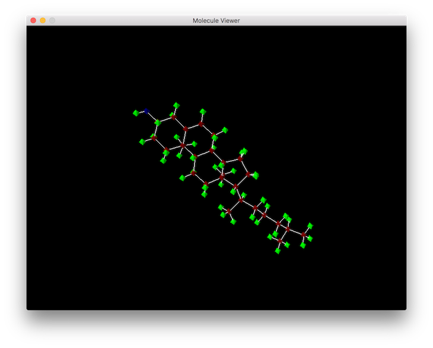
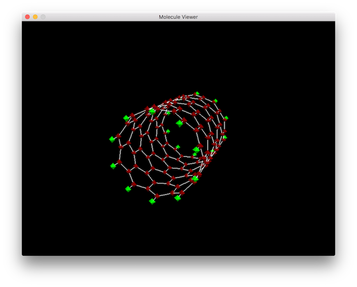
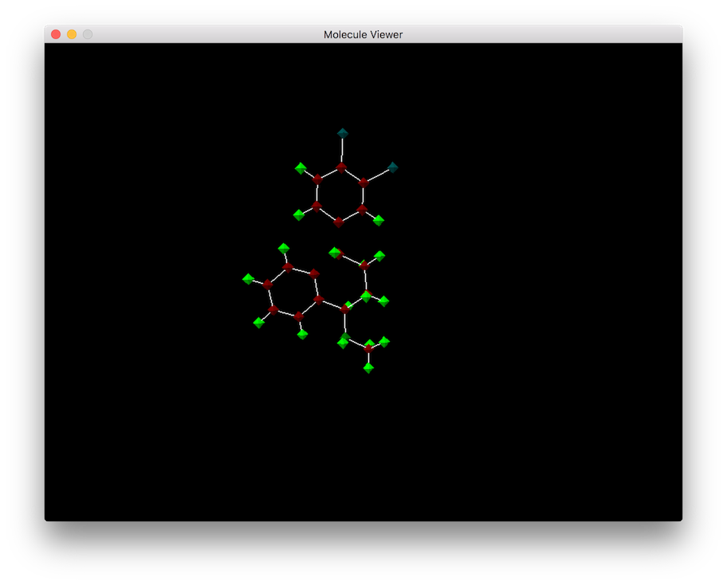

molecule-viewer
===============

### About ###

Molecule viewer is a C++ program for visualizing chemical molecules stored in the [XYZ file format](https://en.wikipedia.org/wiki/XYZ_file_format).


NOTE: This does not aim to be a fully featured program, rather just an experiment in chemical file parsing and rendering.




### Technical ###

XYZ files can be loaded using the first command line argument as the file name, or piped into the program directly.

```shell

molecule path/tofile.xyz
```

Or

```shell
cat path/tofile.xyz | molecule
```

### Requires ###
* [SDL 2](https://www.libsdl.org/)
* Legacy OpenGL.
* C++11
* The Makefile is setup for mac, although it should be easy to change for another OS.


### More Screenshots ###



